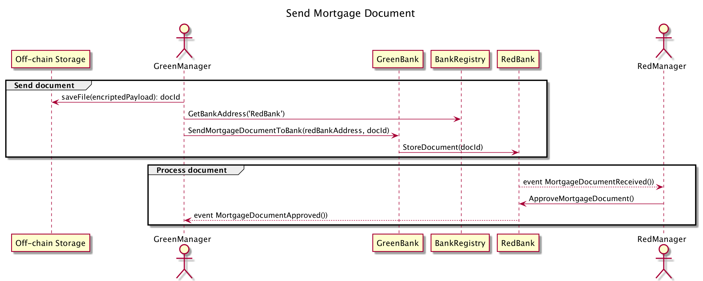
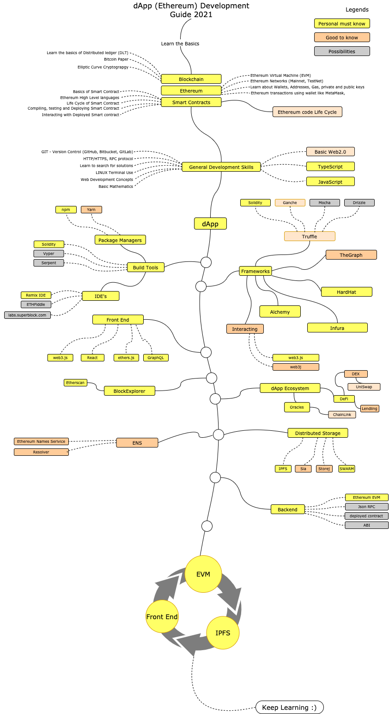

[](https://github.com/AndreyBronin/meetup-mortgage/actions/workflows/ci.yml)

# Демо проект

Простая реализация документооборота на блокчейне.
Текущая реализация пока не использует механизм шифрования документов.



## Как запустить

```
npm install
npm run build
npm run test-logs
```

# TBD
 - file encryption
 - React frontend
 - IPFS storage
 - Subgraph API
 - Solidity linter
 - Test coverage

## Инструменты и утилиты

[Ethereum Developer Tools List](https://github.com/ConsenSys/ethereum-developer-tools-list#ethereum-developer-tools-list)

#### Используемые в этом проекте

 - [HardHat](https://hardhat.org/)
 - [Ganache](https://www.trufflesuite.com/ganache)
 - [The Graph](https://thegraph.com)
 - [Etherscan](https://etherscan.io)
 - [Alchemy](https://www.alchemyapi.io/)
 - [OpenZepplin](https://docs.openzeppelin.com/contracts/)
 - [solidity2plantuml](https://github.com/MaxWdeMon/solidity2plantuml#readme)
 - [web3-react](https://github.com/NoahZinsmeister/web3-react)

## Материалы для обучения

 [Официальная документация Ethereum](https://ethereum.org/ru/developers/docs/)

## Книги
 - [Blockchain in action](https://www.amazon.com/Blockchain-Action-Bina-Ramamurthy/dp/1617296333)
 - [Mastering Blockchain](https://www.amazon.com/Mastering-Blockchain-distributed-consensus-cryptocurrencies/dp/1839213191)

## Статьи

 - [Иерархическая генерация ключей](https://habr.com/ru/company/distributedlab/blog/413627/)
 - [The Complete Guide to Full Stack Ethereum Development](https://dev.to/dabit3/the-complete-guide-to-full-stack-ethereum-development-3j13)
 - [Most common smart contract bugs of 2020](https://medium.com/solidified/most-common-smart-contract-bugs-of-2020-c1edfe9340ac)
 - [Ethereum Smart Contract Security Best Practices](https://consensys.github.io/smart-contract-best-practices/)

## YouTube каналы

 - [Finematics](https://www.youtube.com/c/Finematics/playlists)
 - [ForkLog](https://www.youtube.com/c/forklog/playlists)
 - [DappUniversity](https://www.youtube.com/c/DappUniversity/playlists)
 - [EatTheBlocks](https://www.youtube.com/c/EatTheBlocks/playlists)

## Roadmap



